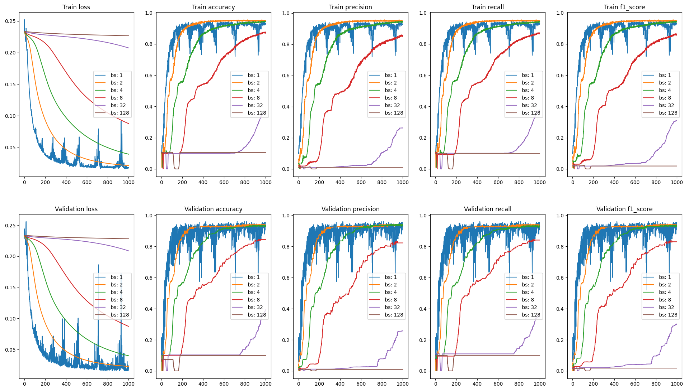
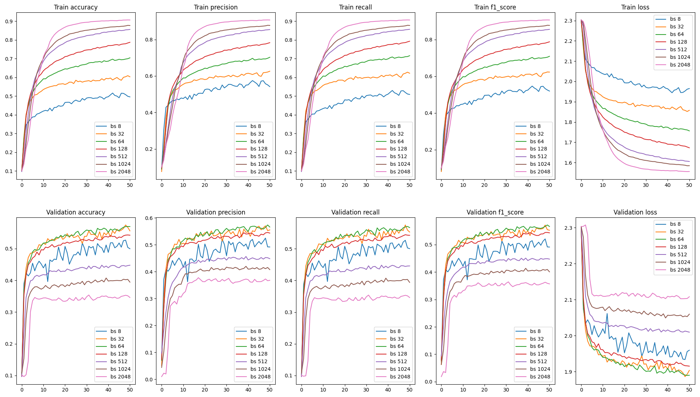

# **Framework Pytorch-like from scratch**
This repository aims to understand in deeply how a deep learning framework like
PyTorch works i.e to build a class that integrates tensors (multidimensional matrices) with automatic
derivation required to define a learning rule for the model (Gradient Descent). The Tensyx
class uses NumPy to implement tensors and manage the automatic differentiation with broadcasting.

Nevertheless, the implementation is in Python, a language whose time and space complexity
is quite poor. Moreover, such a framework needs CPU/GPU optimization in order to reduce the
time complexity for tensor operations. However, this challenge allowed me to see the 
difficulties of such an implementation, including broadcasting during automatic differentiation,
limit values for activation functions to avoid gradients equal to 0, etc.

## **Experimentations**
The usefulness of implementing this framework was to study the learning evolution of any model
with respect to some hyperparameters. Obviously, there are many but we can focus on a few, for instance the batch size,
key parameter that can reduce calculation time, provided you have the right equipment. Here 
are two examples that illustrate how its impact can differ depending the context.

<tr>
	<td align="center">
	  <figure>
		
		<figcaption style="font-family: Arial, sans-serif; font-weight: bold;"><u>Evolution of the MLP model on the classification task according to different batch sizes</u></figcaption>
	  </figure>
	</td>
</tr>

These charts show different metrics on a classification task with 10 classes and 2 features
 for each value. The model used is as follows:
<ul>
	<li>Linear(2, 32)</li>
	<li>ReLU</li>
	<li>Linear(32, 10)</li>
	<li>Softmax</li>
</ul>
The influence of the batch size can be clearly identified, the smaller the batch, the better is the model 
learns in both stages (training and validation). For a batch size of $\mathbf{B = 1}$, all the
 metrics are erratic during the training, to optimize the model's learning the
 best batch size is $\mathbf{B = 2}$.

<tr>
	<td align="center">
	  <figure>
		
		<figcaption style="font-family: Arial, sans-serif; font-weight: bold;"><u>Evolution of YOLOV1 model on CIFAR-10 dataset (Image classification task) according different batches</u></figcaption>
	  </figure>
	</td>
</tr>

**YOLOV1** (**Y**ou **O**nly **L**ook **O**nce **V**ersion **1**) is a major object detection model, which had a 
huge impact in this field in 2016. These charts show the metrics results on the image (32x32x3) classification dataset
**CIFAR-10** with 10 classes (plane, car, bird, cat, deer, dog, frog, horse, ship and truck)
to identify.

This time, the observation is more complex. During the Train stage, the opposite of what we
 observed for the MLP model on the multi-classication task, the higher the batch size, the 
better the learning (during the training stage).

Nevertheless, during the validation stage, something else can be observed. All the metrics indicate that for batch sizes in the interval $\mathbf{[32;80]}$,
the model achieves better results. Unfortunately, this is empirical; while the best batch size lies within $\mathbf{[32;80]}$,
but it is necessary to test all batch sizes in this interval with the same hyperparameters.

In this way, it can be seen empirically that the choice of the best batch size for model learning
can vary greatly depending on the context. This is because YOLOV1 is a model with convolution block
(convolutional layers, normalization, activation) and Multi-layer Perceptrons at the end, which
 is very different from a tested MLP model. But it should be noted that the datasets are also different,
one consists of vectors with two elements, while the other consists of images (3D matrices).
However, the ability to predict the optimal batch size and other hyperparameters simultaneously could optimize the 
learning conditions of the model. Of course, when a model is trained, there are others
conditions to consider such as time, energy and compututational resources. The ability to 
predict these hyperparameters should be valuable, so let's do some math.

